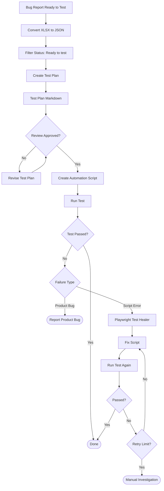

# EasyQA Playwright Workflow

```mermaid
flowchart TD
    A[Bug Report Ready to Test] --> B[Convert XLSX to JSON]
    B --> C[Filter Status: Ready to test]
    C --> D[Create Test Plan]
    D --> E[Test Plan Markdown]
    E --> F{Review Approved?}

    F -- No --> G[Revise Test Plan]
    G --> F
    F -- Yes --> H[Create Automation Script]

    H --> I[Run Test]
    I --> J{Test Passed?}

    J -- Yes --> K([Done])
    J -- No --> L{Failure Type}

    L -- Product Bug --> M([Report Product Bug])
    L -- Script Error --> N[Playwright Test Healer]

    N --> O[Fix Script]
    O --> P[Run Test Again]
    P --> Q{Passed?}

    Q -- Yes --> K
    Q -- No --> R{Retry Limit?}
    R -- No --> O
    R -- Yes --> S([Manual Investigation])
```
